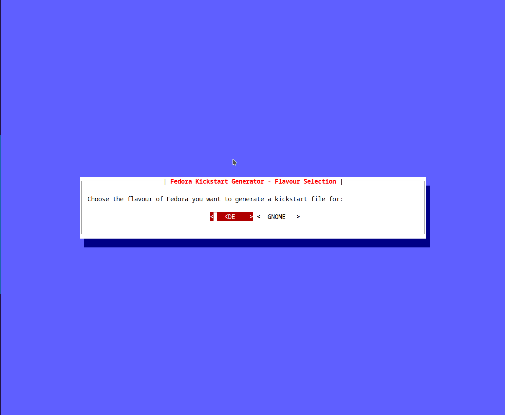

# Demo


# Instalación de dependencias

```
pip install -r requirements.txt 
```

# Plantilla para añadir un nuevo paquete
Todos los campos son obligatorios.
- **name:** Nombre del paquete.
- **package_name:** Nombre del paquete en el repositorio.
- **description:** Breve descripción de la funcionalidad del paquete.
- **third_party_repository:** Repositorio en donde se encuentra el paquete y *False* en caso de no ser necesario.
- **rpm:** Url de descarga del paquete rpm y *False* en caso de no ser necesario.
- **post:** Comandos que irán en la sección *post* del fichero Kickstart.

## Ejemplos

### Paquete *Visual Studio Code*

```yaml
---
name: Visual Studio Code
package_name: code
description: Visual Studio Code is a source-code editor developed by Microsoft.
third_party_repository: repo --name="vscode" --install --baseurl=https://packages.microsoft.com/yumrepos/vscode --cost=0
rpm: False
post: |
  # Visual Studio Code
  cat <<EOF >> /etc/yum.repos.d/vscode.repo
  gpgkey=https://packages.microsoft.com/keys/microsoft.asc
  EOF
  rpm --import https://packages.microsoft.com/keys/microsoft.asc
```

### Paquete rpm *Gitkraken*

```yaml
---
name: gitkraken 
package_name: gitkraken
description: GitKraken is a Git client built on Electron.
third_party_repository: False
rpm: True
post: |
  # gitkraken
  cd /var/tmp
  wget https://release.gitkraken.com/linux/gitkraken-amd64.rpm
  dnf install gitkraken-amd64.rpm -y
```

### Paquete *Google Chrome*

```yaml
---
name: google-chrome
package_name: google-chrome-stable
description: Google Chrome is a web browser from Google.
third_party_repository: repo --name="google-chrome" --install --baseurl=https://dl.google.com/linux/chrome/rpm/stable/$basearch --cost=0
rpm: False
post: |
  # Google Chrome
  cat <<EOF >> /etc/yum.repos.d/google-chrome.repo
  gpgkey=https://dl-ssl.google.com/linux/linux_signing_key.pub
  EOF
  rpm --import https://dl-ssl.google.com/linux/linux_signing_key.pub
```